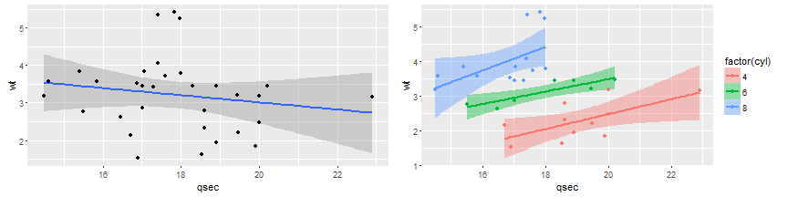

## Let us start


```r
library(knitr)
library(reshape)
dFrame <- melt(HairEyeColor)
kable(head(dFrame[dFrame$Sex == 'Male', ], 4), format = "markdown")
```


|Hair  |Eye   |Sex  | value|
|:-----|:-----|:----|-----:|
|Black |Brown |Male |    32|
|Brown |Brown |Male |    53|
|Red   |Brown |Male |    10|
|Blond |Brown |Male |     3|

---

## Interactive Chart


<div id = 'chart1' class = 'rChart nvd3'></div>
<script type='text/javascript'>
 $(document).ready(function(){
      drawchart1()
    });
    function drawchart1(){  
      var opts = {
 "dom": "chart1",
"width":    800,
"height":    400,
"x": "Hair",
"y": "Freq",
"group": "Eye",
"type": "multiBarChart",
"id": "chart1" 
},
        data = [
 {
 "Hair": "Black",
"Eye": "Brown",
"Sex": "Male",
"Freq":             32 
},
{
 "Hair": "Brown",
"Eye": "Brown",
"Sex": "Male",
"Freq":             53 
},
{
 "Hair": "Red",
"Eye": "Brown",
"Sex": "Male",
"Freq":             10 
},
{
 "Hair": "Blond",
"Eye": "Brown",
"Sex": "Male",
"Freq":              3 
},
{
 "Hair": "Black",
"Eye": "Blue",
"Sex": "Male",
"Freq":             11 
},
{
 "Hair": "Brown",
"Eye": "Blue",
"Sex": "Male",
"Freq":             50 
},
{
 "Hair": "Red",
"Eye": "Blue",
"Sex": "Male",
"Freq":             10 
},
{
 "Hair": "Blond",
"Eye": "Blue",
"Sex": "Male",
"Freq":             30 
},
{
 "Hair": "Black",
"Eye": "Hazel",
"Sex": "Male",
"Freq":             10 
},
{
 "Hair": "Brown",
"Eye": "Hazel",
"Sex": "Male",
"Freq":             25 
},
{
 "Hair": "Red",
"Eye": "Hazel",
"Sex": "Male",
"Freq":              7 
},
{
 "Hair": "Blond",
"Eye": "Hazel",
"Sex": "Male",
"Freq":              5 
},
{
 "Hair": "Black",
"Eye": "Green",
"Sex": "Male",
"Freq":              3 
},
{
 "Hair": "Brown",
"Eye": "Green",
"Sex": "Male",
"Freq":             15 
},
{
 "Hair": "Red",
"Eye": "Green",
"Sex": "Male",
"Freq":              7 
},
{
 "Hair": "Blond",
"Eye": "Green",
"Sex": "Male",
"Freq":              8 
} 
]
  
      if(!(opts.type==="pieChart" || opts.type==="sparklinePlus" || opts.type==="bulletChart")) {
        var data = d3.nest()
          .key(function(d){
            //return opts.group === undefined ? 'main' : d[opts.group]
            //instead of main would think a better default is opts.x
            return opts.group === undefined ? opts.y : d[opts.group];
          })
          .entries(data);
      }
      
      if (opts.disabled != undefined){
        data.map(function(d, i){
          d.disabled = opts.disabled[i]
        })
      }
      
      nv.addGraph(function() {
        var chart = nv.models[opts.type]()
          .width(opts.width)
          .height(opts.height)
          
        if (opts.type != "bulletChart"){
          chart
            .x(function(d) { return d[opts.x] })
            .y(function(d) { return d[opts.y] })
        }
          
         
        
          
        

        
        
        
      
       d3.select("#" + opts.id)
        .append('svg')
        .datum(data)
        .transition().duration(500)
        .call(chart);

       nv.utils.windowResize(chart.update);
       return chart;
      });
    };
</script>


--- &vcenter

## Coming to basic Regression Modelling

$$cov(X, Y) = E[(X - E(X))(Y - E(Y))]$$
$$cov(X, Y) = \frac{1}{n} \sum_{i=1,n}(x - E(X))(y - E(Y))$$
$$cov(X, X) = Var(X) \equiv \sigma^{2}(X)$$
$$cor(X, Y) = \frac{cov(X, X)}{\sigma(X) \sigma(Y)}$$


---

## Regression Modelling continued...


```r
library(knitr)
kable(head(mtcars, 10), format = "markdown")
```


|                  |  mpg| cyl|  disp|  hp| drat|    wt|  qsec| vs| am| gear| carb|
|:-----------------|----:|---:|-----:|---:|----:|-----:|-----:|--:|--:|----:|----:|
|Mazda RX4         | 21.0|   6| 160.0| 110| 3.90| 2.620| 16.46|  0|  1|    4|    4|
|Mazda RX4 Wag     | 21.0|   6| 160.0| 110| 3.90| 2.875| 17.02|  0|  1|    4|    4|
|Datsun 710        | 22.8|   4| 108.0|  93| 3.85| 2.320| 18.61|  1|  1|    4|    1|
|Hornet 4 Drive    | 21.4|   6| 258.0| 110| 3.08| 3.215| 19.44|  1|  0|    3|    1|
|Hornet Sportabout | 18.7|   8| 360.0| 175| 3.15| 3.440| 17.02|  0|  0|    3|    2|
|Valiant           | 18.1|   6| 225.0| 105| 2.76| 3.460| 20.22|  1|  0|    3|    1|
|Duster 360        | 14.3|   8| 360.0| 245| 3.21| 3.570| 15.84|  0|  0|    3|    4|
|Merc 240D         | 24.4|   4| 146.7|  62| 3.69| 3.190| 20.00|  1|  0|    4|    2|
|Merc 230          | 22.8|   4| 140.8|  95| 3.92| 3.150| 22.90|  1|  0|    4|    2|
|Merc 280          | 19.2|   6| 167.6| 123| 3.92| 3.440| 18.30|  1|  0|    4|    4|

---

## Regression Modelling still continues...


```r
library(ggplot2)
library(gridExtra)
base <- ggplot(mtcars, aes(qsec, wt))
pt_1 <- base + stat_smooth(method = "lm") + geom_point()

base <- ggplot(mtcars, aes(y = wt, x = qsec, colour = factor(cyl)))
pt_2 <- base + stat_smooth(method = lm, aes(fill = factor(cyl))) + geom_point()
grid.arrange(pt_1, pt_2, ncol = 2)
```


